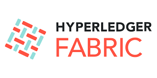

# Hyperledger Fabric

+

If you're here, you likely followed the path from the preceding article. If not, you can catch up on it right here. This piece will try to provide an overview of the inner workings of Hyperledger Fabric (HF), for a concise information, please visit the  [documentation](https://hyperledger-fabric.readthedocs.io/en/release-2.5/whatis.html#), "it's worth your while".

> "[Hyperledger Fabric is an open source enterprise-grade permissioned distributed ledger technology (DLT) platform, designed for use in enterprise contexts, that delivers some key differentiating capabilities over other popular distributed ledger or blockchain platforms](https://hyperledger-fabric.readthedocs.io/en/release-2.5/whatis.html#hyperledger-fabric)".

My suggestion is to go straight to the docs, and I'm especially pointing you towards the [Key Concepts section](https://hyperledger-fabric.readthedocs.io/en/release-2.5/key_concepts.html). It's a one-stop shop for grasping the architecture of the technology – you won't need to resort to reading a book.

So, at the base unit, a Fabric network consists of a **Channel**, or multiple channels in a larger context. Channels is like a room or roundtable where transaction and communication happens, this is where *_privacy and permission_* comes in (only allowed members get into the room),, now at the creation of a channel is a **channel configuration**, sort of like a policy that defines the rules and guides of the channel. This is defined by a special file named configtx.yaml and crafted using the configtxgen tool.

**Organizations** are the corporate entity that wants to transact on a channel, each organization is expected to come with at least a **Peer node**, this peer node is a fundamental component of the network beacause this is where the chaincode lives (a moniker for what HF calls it smartcontract). This chaincode defines the rules/contract between different organizations in executable code, this is the code that access the ledger. 

The **Ledger** which is also housed on the peer node consist of the **Blockchain** and a **World State**. Let me break it down. The Blockchain is the blockchain, the immutable, append-only log of all the transaction in the network. A history that's there to stay. The world state on the other hand is a database that stores the current value of the asset on a blockchain, why is that???, it is because mosts programs(chaincode/smartcontract) usually require the current value of an object; it would be cumbersome to traverse the entire blockchain to calculate an object’s current value – you just get it directly from the world state, period. Currently now the Fabric network supports only LevelDB and CouchDB, a key-value document database,cso this database is frequently changing. To add, if you sum up all the history of the asset in the blockchain at any instant of time, you'll arrive at the value in the world state at that instance of time, I think I've nailed that enough.

Still on the peer nodes, not all peer nodes are the same. There are different types of peer nodes with different roles in the network:

> Endorser peer: Validates transaction (check certificate details and roles) and executes chaincode.

> Anchor peer :  enable cross-organization communication among peer nodes using the Hyperledger Fabric gossip protocol

> Orderer peer : responsible for establishing the correct order of all transactions

You might be sensing that there's more to uncover – and you're absolutely right. I encourage you to delve into the documentation and perhaps explore resources on YouTube as well. Now, let's zoom in on another essential component: the Fabric Gateway Service, also nestled within the Peer. This service plays a crucial role by exposing APIs that your clients (i.e., your backend) can utilize to seamlessly interface with the network. It acts as the bridge, facilitating communication and interaction between your applications and the network itself

 The last thing I will like to mention is the **MSP (Member Service Provider)** - everything that interacts with a blockchain network, including peers, applications (Fabric Gateway), admins, and orderers, acquires their organizational identity from their digital certificate and their Membership Service Provider (MSP) definition. Think of it as the orchestrator that bestows organizational identities upon all elements engaged with a blockchain network

In a nutshell, we've traversed through the essentials: Channels, Organizations, various Peer Nodes (including Endorser, Anchor, and Orderer), Chaincode, Fabric Gateway, the Ledger (comprising Blockchain and World State), and the MSP. Armed with this foundational understanding, delving into the documentation should feel like a breeze. And with that, we conclude.

I am a Go person and I’ll advise you to build real world solution applications with it instead, so join me, become a [gopher](https://go.dev/doc/faq#go_or_golang).